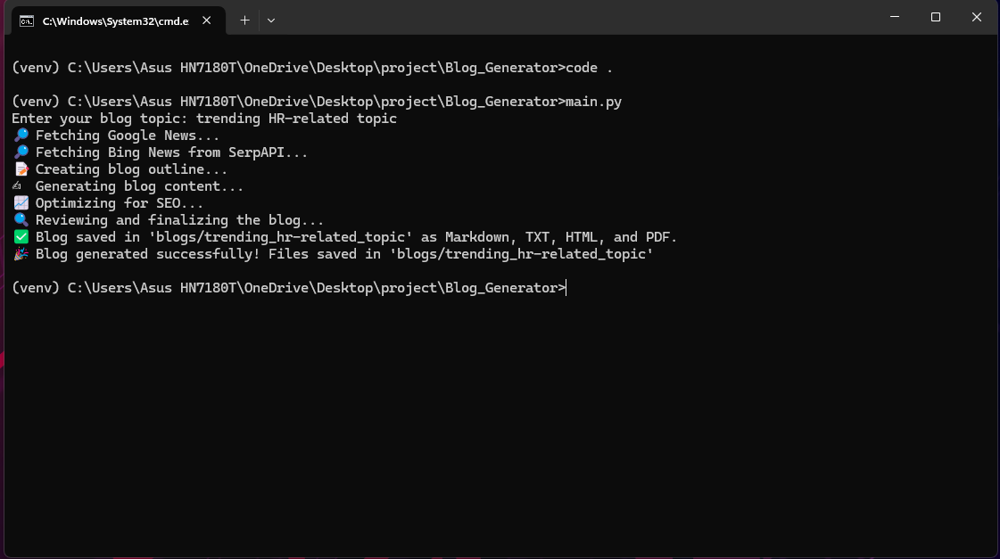

# Multi-Agent SEO Blog Generator

## Overview
Multi-Agent SEO Blog Generator is an AI-powered tool that automates the process of researching, generating, and optimizing SEO-friendly blog content. It fetches trending topics, creates structured blog content, optimizes for search engines, and saves the output in multiple formats including Markdown, TXT, HTML, and PDF.

---

## System Architecture
```
📂 Multi-Agent-SEO-Blog-Generator
├── 📂 blog
│   ├── 📂 trending_hr-related_topic
│       ├── 📄 trending_hr-related_topic.html
│       ├── 📄 trending_hr-related_topic.md
│       ├── 📄 trending_hr-related_topic.pdf
│       ├── 📄 trending_hr-related_topic.txt
├── 📂 img
│   ├── 📄 output.png 
├── 📄 main.py         # Entry point for the blog generation process
├── 📄 research.py     # Fetches trending news topics 
├── 📄 utils.py        # Utility functions for blog creation
├── 📄 generate.py     # AI-based text generation (uses Gemini API)
├── 📄 saveblogs.py    # Handles file saving operations (MD, TXT, HTML, PDF)
├── 📄 APIkeys.py      # Manages API keys securely (Gemini & SerpAPI)
├── 📄 README.md       # Documentation
├── 📄 requirements.txt # Dependencies
```

---

## Screenshot
<p align="center">
  
</p>

---

## Agent Workflow
1. **User Input**: Enter the blog topic.
2. **Research**: Fetches relevant news from Google News and Bing News using SerpAPI.
3. **Outline Creation**: Generates a structured outline based on research.
4. **Content Generation**: Uses Gemini AI to generate a full-length blog post.
5. **SEO Optimization**: Enhances content with SEO best practices and keyword insertion.
6. **Review**: Checks for grammar, clarity, and coherence.
7. **Save & Export**: Saves the blog in Markdown, TXT, HTML, and PDF formats.

---

## Tools and Frameworks Used
- **Google Gemini API** - AI-powered content generation
- **SerpAPI (Bing News)** - Fetching trending news topics
- **Feedparser** - Parsing Google News RSS feeds
- **FPDF** - Generating PDF files
- **Markdown** - Converting content to HTML
- **OS & Time Libraries** - File handling and execution control

---

## Installation and Execution
### Prerequisites

### Cloning the Repository
```sh
git clone https://github.com/raghul-tech/Multi-Agent-SEO-Blog-Generator
cd Multi-Agent-SEO-Blog-Generator
```

- Python 3.7+
- It is recommended to use a virtual environment:
  ```sh
  python -m venv venv
  source venv/bin/activate  # On macOS/Linux
  venv\Scripts\activate  # On Windows
  ```
- Install dependencies:
  ```sh
  pip install -r requirements.txt
  ```

### Setting Up API Keys
#### Google Gemini API Key
1. Sign up at [Google AI](https://ai.google.dev/) and create an account.
2. Navigate to the Gemini AI section and click **Get API Key** at the top.
3. Copy the key and add it to `APIkeys.py`:
    ```python
    api_keys = {
        "GEMINI_API_KEY": "your-gemini-api-key-here",
        "SERPAPI_KEY": "your-serpapi-key-here"
    }
    ```

#### SerpAPI (Bing News API)
1. Register at [SerpAPI](https://serpapi.com/) and create an account.
2. Search for **Bing News API** to get your key  .
3. Copy the key and add it to `APIkeys.py`.

### Running the Blog Generator
Execute the following command:
```sh
python main.py
```
Enter the blog topic when prompted, and the generated blog will be saved in the `blogs/` directory.

---

## Output Formats
The generated blog is saved in:
- **Markdown (.md)**
- **Plain text (.txt)**
- **HTML (.html)**
- **PDF (.pdf)**

---

## License
This project is licensed under the **MIT License**.
